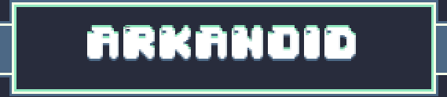

  

# Project Arkanoid

Project Arkanoid is a retro arcade brick-breaker developed in **C++** with **SDL2**, inspired by the classic Arkanoid formula and built with a custom pixel-art presentation.

The game features a dark arcade-style interface, hand-made visual assets, glowing menu elements, framed UI panels, and large pixel typography designed for clarity and atmosphere. The visual direction focuses on creating a cohesive retro mood while keeping the player experience readable and direct.

Beyond the visual presentation, the project was built with a clean object-oriented architecture, a scene system for menus and gameplay states, data-driven level layouts, and careful memory management using modern C++ practices.

## Gameplay Preview

  

## Features
- **Scene System:** Independent management for menus, game levels, and transitions.
- **Entity Component Logic:** Robust base for game objects with a full lifecycle: `start`, `update`, and `render`.
- **Memory Optimization:** Strict use of `std::unique_ptr` to prevent memory leaks and static members for shared texture management.
- **Brick Pooling:** Pre-instantiated brick repository to optimize performance and reduce runtime allocations.
- **Data-Driven Levels:** Level layouts loaded from matrices, allowing for easy map creation without modifying the source code.

## Setup and Execution
1.  **Environment:** Designed for **Visual Studio 2022 (x64)**.
2.  **Dependencies:** SDL2, SDL2_image and SDL2_ttf (included in the `external/` folder for immediate compilation).
3.  **Compilation:**
    *   Open `ProjectArkanoid.sln`.
    *   Set configuration to `x64` (Debug or Release).
    *   Press `F5` to build and run.

## Project Structure
*   `src/`: Source code files.
*   `include/`: Header files.
*   `assets/`: Visual game resources (textures, etc.).
*   `external/`: Third-party libraries and headers.

## Author
*   **Dracoangie** - [GitHub](https://github.com/Dracoangie)

*	All assets were created by me and are available for free use.